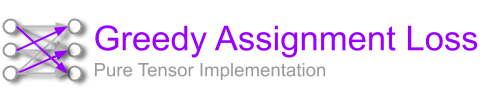
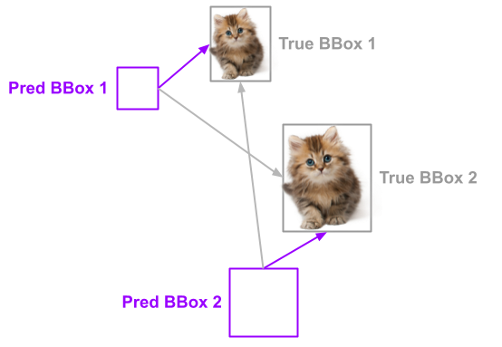

# Hungarian Loss




[](https://github.com/mmgalushka/hungarian-loss/actions)
[](https://codecov.io/gh/mmgalushka/hungarian-loss)
[](https://www.codacy.com/gh/mmgalushka/hungarian-loss/dashboard?utm_source=github.com&amp;utm_medium=referral&amp;utm_content=mmgalushka/hungarian-loss&amp;utm_campaign=Badge_Grade)
[](https://github.com/psf/black)


[](https://github.com/mmgalushka/hungarian-loss/blob/main/LICENSE)

Computes the mean squared error between `y_true` and `y_pred` objects with prior assignment using the Hungarian algorithm.

## Installing

Install and update using [pip](https://pip.pypa.io/en/stable/quickstart/):

```bash
~$ pip install hungarian-loss
```

Note, this package does not have extra dependencies except Tensorflow :tada:.

## How to use it?

The following example shows how to compute loss for the model head predicting bounding boxes.

```Python
from hungarian_loss import hungarian_loss

model = ...

losses = {"...": ..., "bbox": hungarian_loss}
lossWeights = {"...": ..., "bbox": 1}

model.compile(optimizer='adam', loss=losses, loss_weights=lossWeights)

```

## Where to use it?

Let's assume you are working on a deep learning model detecting multiple objects on an image. For simplicity of this example, let's consider, that our model intends to detect just two objects of kittens (see example below).



Our model predicts 2 bounding boxes where it "thinks"  kittens are located. We need to compute the difference between true and predicted bounding boxes to update model weights via back-propagation. But how to know which predicted boxes belong to which true boxes? Without the optimal assignment algorithm which consistently assigns the predicted boxes to the true boxes, we will not be able to successfully train our model.

The loss function implemented in this project can help you. Intuitively you can see that predicted BBox 1 is close to the true BBox 1 and likewise predicted BBox 2 is close to the true BBox 2. the cost of assigning these pairs would be minimal compared to any other combinations. As you can see, this is a classical assignment problem. You can solve this problem using the Hungarian Algorithm. Its Python implementation can be found here. It is also used by DERT Facebook End-to-End Object Detection with Transformers model. However, if you wish to use pure tensor-based implementation this library is for you.

## How it works?

To give you more insights into this implementation we will review a hypothetical example. Let define true-bounding boxes for objects T1 and T2:

| Object | Bounding boxes |
|--------|----------------|
| T1     | 1., 2., 3., 4. |
| T2     | 5., 6., 7., 8. |

Do the same for the predicted boxes P1 and P2:

| Object | Bounding boxes |
|--------|----------------|
| P1     | 1., 1., 1., 1. |
| P2     | 2., 2., 2., 2. |

et's compute the Euclidean distances between all combinations of True and Predicted bounding boxes:

|    | P1        | P2       |
|----|-----------|----------|
| T1 | 3.7416575 | 2.449489 |
| T2 | 11.224972 | 9.273619 |

This algorithm will compute the assignment mask first:

|    | P1 | P2 |
|----|----|----|
| T1 | 1  | 0  |
| T2 | 0  | 1  |

And then compute the final error:

`loss = (3.7416575 + 9.273619) / 2 = 6.50763825`

In contrast, if we would use the different assignment

`loss = (2.449489 + 11.224972) / 2 = 6.8372305`
